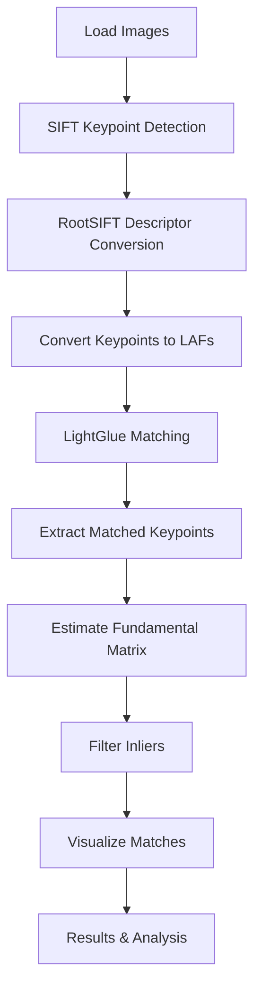
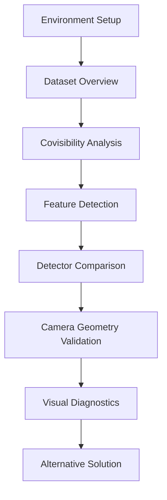

# Image Matching Challenge 2024

## Project Overview
This repository contains two key notebooks for the Kaggle Image Matching Challenge 2024:

- **image-matching.ipynb**: The main notebook, implementing a robust image matching pipeline using SIFT features and LightGlue matcher.
- **IMC-2024-SFM.ipynb**: The end notebook, presenting an alternative solution and exploratory analysis, including data understanding and computer vision fundamentals.

Both notebooks are designed for reproducibility and comparison, offering complementary approaches to image matching and scene analysis.

---

## 1. Notebook 1: image-matching.ipynb

### Purpose
Implements a full image matching pipeline using classic SIFT keypoints and the modern LightGlue attention-based matcher. Designed for pairwise image matching tasks and robust geometric verification.

### Workflow Steps
1. Load images
2. Detect SIFT keypoints and descriptors
3. Convert descriptors to RootSIFT
4. Transform keypoints to Local Affine Frames (LAFs)
5. Match descriptors with LightGlue
6. Extract matched keypoints
7. Estimate fundamental matrix with RANSAC
8. Filter inliers
9. Visualize matches
10. Analyze results

### Pipeline Diagram


---

## 2. Notebook 2: IMC-2024-SFM.ipynb

### Purpose
Serves as an alternative solution and exploratory notebook. It provides detailed data understanding, scene-level statistics, covisibility analysis, and computer vision fundamentals (feature detection, comparison, and geometry validation).

### Key Sections
- Environment setup & imports
- Dataset overview & loading
- Covisibility analysis (real image pairs)
- Feature detection (SIFT, ORB, AKAZE)
- Detector comparison (stats & visuals)
- Camera geometry validation
- Visual diagnostics and EDA

### Workflow Diagram


---

## Usage
- Use **image-matching.ipynb** for the main pipeline and step-by-step code.
- Use **IMC-2024-SFM.ipynb** for exploratory analysis and alternative approaches.

## Credits
- [Kornia](https://github.com/kornia/kornia)
- [LightGlue](https://github.com/cvlab-epfl/lightglue)
- [Kornia-Moons](https://github.com/ducha-aiki/kornia_moons)
- [OpenCV](https://opencv.org/)

---

**Made for the Kaggle Image Matching Challenge 2024**
- Only matches consistent with the estimated geometry are retained as inliers. These are the most reliable correspondences.

### Visualize Matches
- Matches are visualized using Kornia-Moons’ `draw_LAF_matches`. Inliers are shown in green, tentative matches in yellow. Visualization helps interpret the quality and distribution of matches.

### Results & Analysis
- The pipeline produces robust matches even under challenging conditions (scale, rotation, lighting). Results can be analyzed for accuracy, coverage, and reliability.

## Workflow Diagram


### Explanation
- **Load Images**: Input images for matching.
- **SIFT Keypoint Detection**: Find keypoints and descriptors using SIFT.
- **RootSIFT Descriptor Conversion**: Normalize descriptors for better matching.
- **Convert Keypoints to LAFs**: Transform keypoints to Local Affine Frames for geometric context.
- **LightGlue Matching**: Use attention-based matcher to find tentative correspondences.
- **Extract Matched Keypoints**: Retrieve coordinates of matched points.
- **Estimate Fundamental Matrix**: Use RANSAC to estimate geometric relationship.
- **Filter Inliers**: Keep only geometrically consistent matches.
- **Visualize Matches**: Show results with inliers and tentative matches.
- **Results & Analysis**: Review and interpret the output.

## Example Pipeline Diagram
```
Image A   Image B
   |         |
 [SIFT]   [SIFT]
   |         |
 [RootSIFT descriptors]
   |         |
 [LightGlue Matcher]
   |         |
 [Tentative Matches]
   |         |
 [RANSAC Geometric Verification]
   |         |
 [Inlier Matches]
   |         |
[Visualization]
```

## Results
- The pipeline produces robust matches even under challenging conditions (scale, rotation, lighting).
- Combines the strengths of classic SIFT and modern deep learning-based matching.

## Usage
- See `sift_lightglue_matching.ipynb` for the full code and step-by-step explanations.
- Adapt image paths and parameters as needed for your dataset.

## Credits
- [Kornia](https://github.com/kornia/kornia)
- [LightGlue](https://github.com/cvlab-epfl/lightglue)
- [Kornia-Moons](https://github.com/ducha-aiki/kornia_moons)
- [OpenCV](https://opencv.org/)

---

**Made for the Kaggle Image Matching Challenge 2024**


